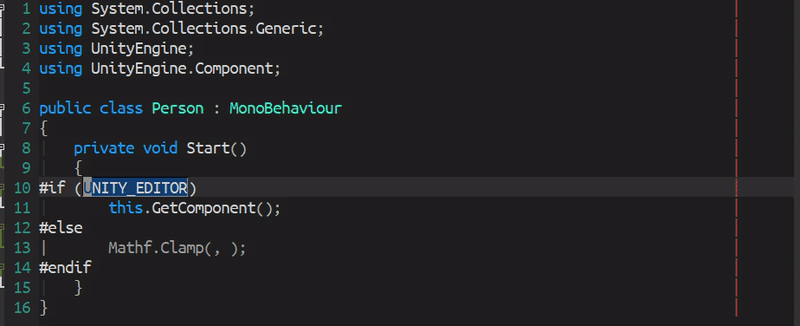

[](https://www.gnu.org/licenses/gpl-3.0)
[](https://celpa.conao3.com/#/hl-preproc)
[](https://jcs-emacs.github.io/jcs-elpa/#/hl-preproc)

# hl-preproc
> Unhighlight invalid preprocessor region


<p align="center">
  
</p>

This package uses [meta-net](https://github.com/emacs-vs/meta-net) to parse
all define constants inside a csproj file. The output of the highlighting
should be very close to IDE but more lightweight. We only extract information
we need to do the highlighting.

## :floppy_disk: Quickstart

```el
(use-package hl-preproc
  :ensure t
  :hook (csharp-mode . (lambda () (hl-preproc-mode 1))))
```

## :hammer: Basic Usage

##### `(hl-preproc-mode &optional ARG)`

To enable/disable this package.

##### `hl-preproc-extra-constants`

Extra define constants, just in case if [meta-net](https://github.com/emacs-vs/meta-net)
does not parse define constants correctly.

##### `hl-preproc-delay`

Seconds of delay before highlighting invalid preprocessor regions.

##### `hl-preproc-face`

Face to highlight all invalid code.

## :link: References

* [C# - Preprocessor Directives](https://www.tutorialspoint.com/csharp/csharp_preprocessor_directives.htm)

## Contribute

[](http://makeapullrequest.com)
[](https://github.com/bbatsov/emacs-lisp-style-guide)

If you would like to contribute to this project, you may either
clone and make pull requests to this repository. Or you can
clone the project and establish your own branch of this tool.
Any methods are welcome!
